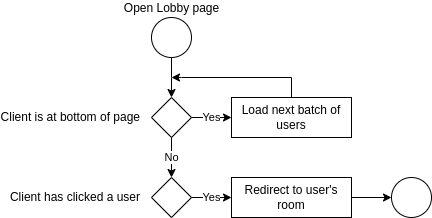
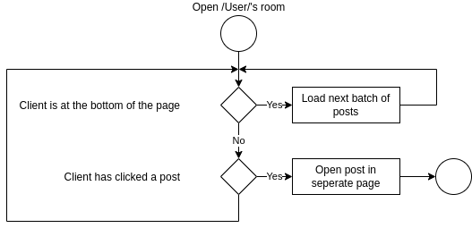
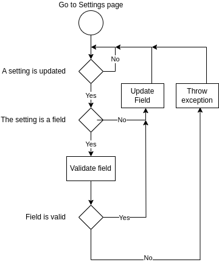
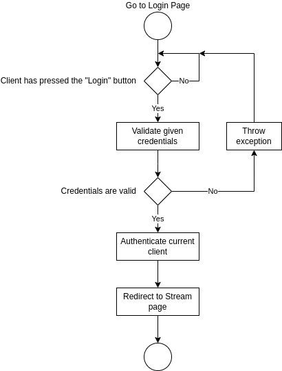
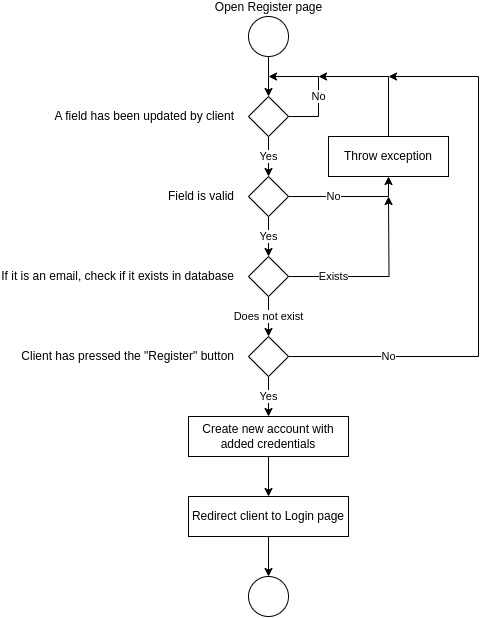

[Overview](../README.md)

# Views

---

## About Every View

- Stream
  - Shows posts of all users followed by the currently logged in user. They are sorted by date in descending order (from most recent to oldest). They are loaded in collections of N amount of posts, and as a result when the user scrolls to the end, a new N amount of posts will be loaded on demand. This is done with the intent of saving computational power on both the database and the client.
  

- Lobby
  
  - This view shows all users of the site, sorted by date of registration in descending order.
  

- /Username/'s room
  - This view presents all posts made by the selected user.
  - If this user has allowed, their followers and followed can be seen.
  

- Settings
  - Here the currently logged user can change their display name, username, email and password.
  

- Login/Register
  - I do not have to explain what these are meant for.
  
  
---

## Administrator Views

- Report Directory
  
  - Here are stored all reports sent by users of the site. They may or may not be related to a specific user.

---

## Developer Comment

  In my opinion, administrator functions should be integrated as normal buttons, not seperated into an admin panel.
